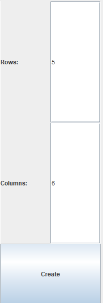
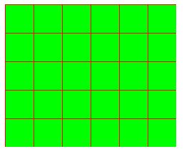
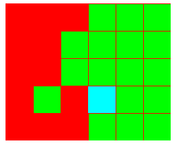
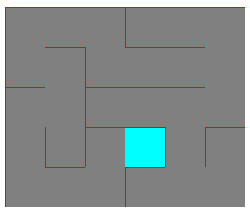

# ProiectPA
## Maze Generator
### by Mihaita Cristian Constantin 3E2

Functionalities:
- Create n x m matrix
- Create a maze using the Growing Tree generation algorithm
- Export the generated maze as a png file 

#### 1 Create Maze
Set the desired number of Rows and Columns in the appropriate text fields:and press the *"Create"* button:

#### 2 Export Maze
You can export a generated maze (solved or not) via the "Export" button. This will save the maze a png file.

#### 3 Run Maze generation algorithm
Click the "Run" button. The program will them run the maze matrix through a "Growing Tree Algorithm" in order to generate a maze.

##### 3.1 Growing tree algorithm
This algorithm uses a Stack of visited cells. The next cell to *"visited"* is an unvisited neighbour of the top cell in the stack. If the top stack does not have an unvisited neighbour, the cell is *"kicked"* from the stack and never to be visited. 
The algorithm runs while there are cells in the stack, or until the starting cell is kicked from the stack.
The "wall" between two neighbours is removed if the algorithm visits them in sequence.

##### 3.2 Growing tree algorithm visualization

The cells have 4 colors:
* CYAN:
    * The cell is the randomly chosen *starting cell* 
* GREEN:
  * An *unvisited cell*
* RED:
    * A *visited cell* that is currently on the stack
* GREY:
    * A *kicked cell* that was removed from the visiting stack 

a. Unsolved maze matrix:

b. Algorithm in progress:

c. Solved maze:

#### 4 Useful links:
- Growing tree algorithm: http://www.astrolog.org/labyrnth/algrithm.htm

- https://weblog.jamisbuck.org/2011/1/27/maze-generation-growing-tree-algorithm
